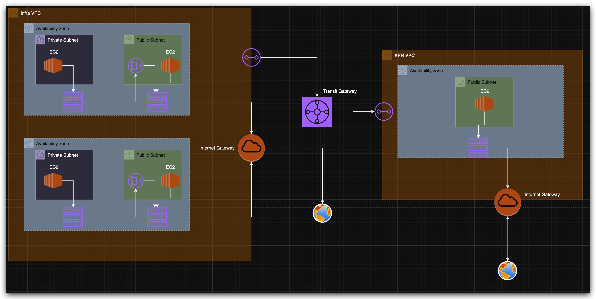
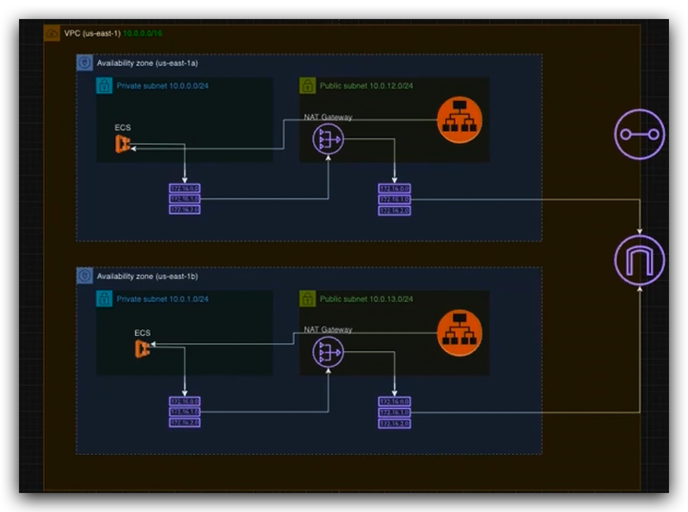

# FarmerUp Online - Cloud Infrastructure  

Welcome to **[FarmerUp.online](https://farmerup.online)**, a startup. 
Here you can find the entire cloud infrastructure created for my startup from scratch, ensuring scalability, availability, and security. This document outlines the architecture and evolution of the infrastructure.

---

## Infrastructure Overview  

The infrastructure was built in **two stages**:  

### **1️⃣ Initial Infrastructure Setup** (Start Point)  

To establish a **secure and reliable** foundation, I created an **Infra VPC** with the following features:  

- **High Availability**:  
  - Designed across **two availability zones (AZs)** for failover and redundancy.  
- **Network Segmentation**:  
  - **Public and Private Subnets**:  
    - Public subnet exposes necessary services.  
    - Private subnet is protected but still needs internet access for outbound traffic.  
  - **NAT Gateway**:  
    - Used to provide **internet access** to the private subnet without exposing it directly.  
- **Secure VPN Access**:  
  - Created a **VPN VPC** for accessing the Infra VPC securely from a **personal VPC endpoint**.  
  - Connected both VPCs via a **Transit Gateway** for seamless private communication.  

**Network Diagram (Initial Phase)**  
  

---

### **2️⃣ Improved Infrastructure (Scaling & Optimization)**  

I discovered new solutions in AWS for me, which are optimize for **performance, security, and cost-efficiency**.  

- **2 AZs maintained**.  
- **ECS-based Architecture**:  
  - **Private Subnet**:  
    - **Amazon ECS (Elastic Container Service)** runs the backend services Django (app) and PostgreSQL (DB) as different tasks.  
    - Internet access for ECS via **NAT Gateway**.  
  - **Public Subnet**:  
    - **Application Load Balancer (ALB)** to handle incoming requests and distribute them efficiently.  

**Network Diagram (Optimized Phase)**  
  

---

## 🔧 **Technologies Used**  
- **AWS Services**: VPC, ECS, ALB, NAT Gateway, Transit Gateway, VPN, PostgreSQL  
- **Docker (ECS)**: Containerized backend services  
- **Django**: Backend framework  
- **Terraform** : Infrastructure as Code for automation  

---

🔗 **Website**: [FarmerUp.online](https://farmerup.online)  
📧 **Email**: erik.badalyan700@gmail.com  